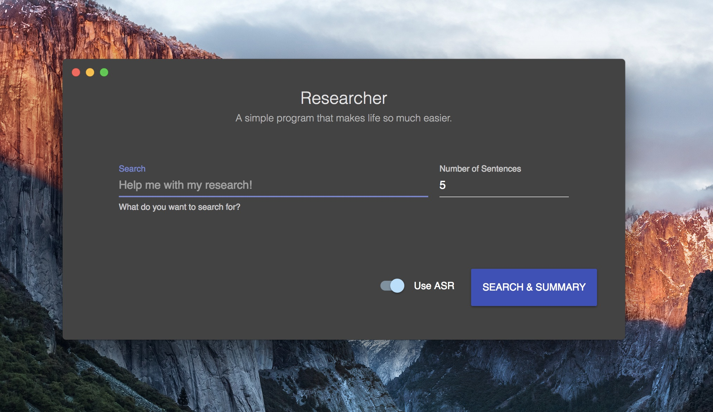

Researcher
==========

An research tool that helps you create a paragraph to
summarize a research topic. GPLv3 licensed.

## Installation

Download the latest version of Researcher in
[Releases](https://github.com/SuperMarcus/Researcher/releases).

## What does it do?

The Researcher itself is a tool I created to help people
quickly create a paragraph of text generated from Google
search. The tool will search a topic you entered and
randomly pick some sentences from the search results and
form a paragraph based on those results.

## What's the purpose of it?

To help people summarize the text from Google without
going through it one by one! This tool is not designed
for people to copy work from the internet directly. You
have to know and be responsible of what you are doing!

## How to use it?

Using this tool is as simple as it can be! Just open it
up, and follow the prompts. The wizard will guide you
through everything.

If Researcher detected any search results that contains
irregular characters, it will ask you if you want to put
that search result in the context or not.

After the search, Researcher will automatically replace
words with their synonyms if it founds any appropriate
candidate in its database (with `Use ASR` enabled).

Researcher uses `pgoogle` internally:
[pgoogle](https://github.com/SuperMarcus/pgoogle).
Check out this tool too if you prefer Command Line
Interface over graphical.
